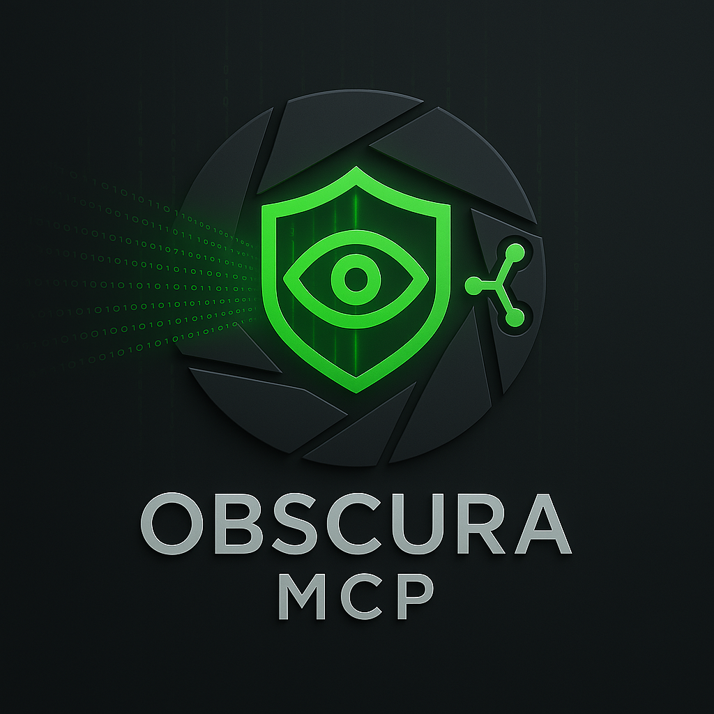

# Obscura MCP

[]()
[](LICENSE)
[](package.json)

> A secure MCP server implementation that provides prompt injection detection and security risk analysis with proxy functionality to act as safe MCP client between your MCP client and MCP servers.

<p align="center">
<br>
</p>

## 🔒 Features

- **Prompt Injection Detection**: Analysis of text inputs to detect potential prompt injection attacks
- **Security Risk Assessment**: Evaluation of commands and data with confidence scoring
- **AI-Powered Security**: Deep learning-based detection using transformer models
- **Multi-Layer Security**:
  - Layer 1: Fast regex-based pattern matching for known threats
  - Layer 2: AI model analysis for novel threats detection
- **Broker Functionality**: Acts as a secure gateway for other MCP servers
- **Model Flexibility**:
  - Multiple model options (local inference and API-based)
  - Automatic model downloading and caching
  - Configurable model precision and execution devices
- **Detailed Verification Reports**: Security verification for all processed content

## 📊 Security Verification Reports

When using the broker to call tools on other MCP servers, results include detailed security verification:

```
━━━━━━━━━━━━━━━━━━━━━━━━━━━━━━━━━━━━━━━━━━━━━━━━━━━━━━━━━━━━━━━━━━━━
🔒 SECURITY VERIFICATION REPORT
━━━━━━━━━━━━━━━━━━━━━━━━━━━━━━━━━━━━━━━━━━━━━━━━━━━━━━━━━━━━━━━━━━━━
Source: MCP server "server-name" (server-id)
Verification time: [timestamp]
━━━━━━━━━━━━━━━━━━━━━━━━━━━━━━━━━━━━━━━━━━━━━━━━━━━━━━━━━━━━━━━━━━━━
✓ INPUT SECURITY: VERIFIED (99.9% confidence)
  Risk level: LOW
✓ OUTPUT SECURITY: VERIFIED (99.6% confidence)
  Risk level: LOW
━━━━━━━━━━━━━━━━━━━━━━━━━━━━━━━━━━━━━━━━━━━━━━━━━━━━━━━━━━━━━━━━━━━━
✅ OVERALL STATUS: CONTENT VERIFIED SECURE
━━━━━━━━━━━━━━━━━━━━━━━━━━━━━━━━━━━━━━━━━━━━━━━━━━━━━━━━━━━━━━━━━━━━
```

## 🛠️ Available Tools

| Tool | Description | Input Parameters |
|------|-------------|-----------------|
| **check_prompt_injection** | Analyzes text for security risks and prompt injection attempts | `text` (string): The text content to analyze |
| **assess_command_risk** | Evaluates commands for potential security risks | `command` (string): The command/instruction to evaluate |
| **list_broker_servers** | Lists all available MCP servers in the broker | *No parameters required* |
| **list_broker_tools** | Lists all tools available on a specific server | `server_id` (string): ID of the server |
| **call_broker_tool** | Calls a tool on a server with security checks | `server_id` (string): Server ID<br>`tool_name` (string): Tool name<br>`arguments` (object): Tool arguments |
| **check_broker_status** | Checks if broker is ready to use | *No parameters required* |
| **add_broker_server** | Adds a new server configuration | `server_config` (object): Full server config |
| **remove_broker_server** | Removes a server configuration | `server_id` (string): ID of server to remove |

## 🚀 Quick Start

### Installation Options

#### Using npm/npx (Recommended)

```bash
# Use directly with npx (no installation)
npx github:SinatrasC/obscura-mcp

# Or install globally
npm install -g @sinatrasc/obscura-mcp
obscura-mcp
```

#### From GitHub Repository

```bash
# Clone the repository
git clone https://github.com/SinatrasC/obscura-mcp.git
cd obscura-mcp

# Install dependencies and build
npm install
npm run build

# Configure environment
cp .env.example .env
# Edit .env with your settings

# Run the server
npm start
```

## ⚙️ Configuration

### Environment Variables

Configure using environment variables or a `.env` file:

```bash
# --- Could be required for remote models ---
HF_API_TOKEN=your_huggingface_token_here

# --- Core Settings ---
SECURITY_MODEL_NAME=protectai/deberta-v3-base-prompt-injection-v2
MODEL_DTYPE=fp32  # fp32, fp16, q8, q4
MODEL_DEVICE=cpu  # cpu, dml, webgpu
ALLOW_REMOTE_MODELS=true

# --- Security Settings ---
JAILBREAK_THRESHOLD=0.5  # 0.0-1.0
ENABLE_REGEX_CHECKS=true
ENABLE_MODEL_CHECKS=true

# --- Broker Configuration ---
BROKER_CONFIG={"enabled":true,"servers":[...]}
```

### Broker Configuration

The broker can be configured with security layers for each server:

```json
{
  "enabled": true,
  "globalSecurity": {
    "enableRegexChecks": true,
    "enableModelChecks": true
  },
  "servers": [
    {
      "id": "unique-id",
      "name": "User-Friendly Name",
      "description": "Description of the server",
      "connection": {
        "type": "stdio",
        "command": "command-to-run",
        "args": ["arg1", "arg2"],
        "env": {
          "ENV_VAR1": "value1"
        }
      },
      "security": {
        "scanInputs": true,
        "scanOutputs": true,
        "inputSecurity": {
          "enableRegexChecks": true,
          "enableModelChecks": true
        },
        "outputSecurity": {
          "enableRegexChecks": true,
          "enableModelChecks": false
        }
      }
    }
  ]
}
```

## 🔐 Security Layers

### Layer 1: Regex Checks
Fast pattern matching against known attack patterns:
- SQL Injection patterns
- Command Injection patterns
- XSS patterns
- Prompt Injection patterns

### Layer 2: AI Model Analysis
Deep learning-based detection:
- Uses the `protectai/deberta-v3-base-prompt-injection-v2` model
- Provides confidence scores with assessments
- Detects novel and complex threat patterns

## 🔌 Integration

### With Claude Desktop

Add to your `claude_desktop_config.json`:

```json
{
    "mcpServers": {
        "obscura-mcp": {
            "command": "node",
            "args": [
                "path/dist/src/index.js"
            ],
            "env": {
                "HF_API_TOKEN": "hf_xxxxxxxxxxxxxxxxxxxxxxxxxxxxxxxx",
                "HF_MODEL_ENDPOINT": "https://api-inference.huggingface.co/models/protectai/deberta-v3-base-prompt-injection-v2",
                "ALLOW_REMOTE_MODELS": "true",
                "MODEL_DTYPE": "fp32",
                "MODEL_DEVICE": "dml",
                "JAILBREAK_THRESHOLD": "0.5",
                "ENABLE_REGEX_CHECKS": "true",
                "ENABLE_MODEL_CHECKS": "true",
                "BROKER_CONFIG": "{\"enabled\":true,\"globalSecurity\":{\"enableRegexChecks\":true,\"enableModelChecks\":true},\"servers\":[{\"id\":\"bravesearch\",\"name\":\"brave-search\",\"description\":\"Performs web searches using Brave Search API\",\"connection\":{\"type\":\"stdio\",\"command\":\"node\",\"args\":[\"path/to/brave-search/dist/index.js\"],\"env\":{\"BRAVE_API_KEY\":\"your-brave-search-api-key\"}},\"security\":{\"scanInputs\":true,\"scanOutputs\":true,\"inputSecurity\":{\"enableRegexChecks\":false,\"enableModelChecks\":true},\"outputSecurity\":{\"enableRegexChecks\":false,\"enableModelChecks\":true}}}]}"
            }
        }
    }
}
```

This configuration:
1. Sets up Obscura MCP with DirectML acceleration for Windows (`MODEL_DEVICE: "dml"`)
2. Configures both regex and AI model security checks
3. Adds a Brave Search server through the broker with:
   - Full AI model security scanning on inputs and outputs
   - Regex checks disabled (Better rules are WIP)
   - Proper API key configuration

> **Note**: Replace the placeholder API keys and file paths with your actual values.

### With Other MCP Clients

Configure any MCP-compatible client to connect via stdio:

```bash
# If running from npm
npx github:SinatrasC/obscura-mcp

# If running from clone
npm start
```

## 📚 Model Information

Uses the `protectai/deberta-v3-base-prompt-injection-v2` model by default, trained specifically for prompt injection detection. The model is downloaded automatically on first use and cached locally.

## 📝 License

[MIT License](LICENSE) - Created by SinatrasC

## 🤝 Contributing

Contributions welcome! Please feel free to submit a Pull Request.
